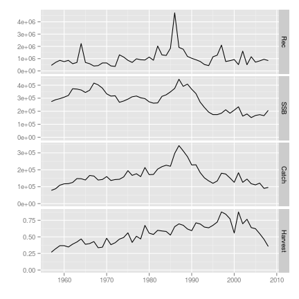

Welcome to FLR. This is going to be a short run through some of the basic elements of the main FLR packages. For further learning material, please visit the [learning page]({{ site.baseurl }}learning/learning.html) or the sites for [each individual package]({{ site.baseurl }}pkgs/pkgs.html).

# Installing the FLR packages

We start by installing the most recent version of the FLR packages. Most FLR packages are currently not available in [CRAN](http://cran.r-project.org), but are distribiuted through the FLR Project package repository. To install the first of the packages, *FLCore*, please type:


# install.packages(c('FLCore'), repos='http://flr-project.org/R')


# FLCore


library(FLCore)



## Loading required package: grid
## Loading required package: lattice
## Loading required package: MASS
## FLCore 2.5.0 development version
## 
## 
## Attaching package: 'FLCore'
## 
## The following objects are masked from 'package:base':
## 
##     cbind, rbind



library(ggplotFL)



## Loading required package: ggplot2
## 
## Attaching package: 'ggplot2'
## 
## The following object is masked from 'package:FLCore':
## 
##     %+%
## 
## Loading required package: gridExtra
## Loading required package: reshape2



data(ple4)



plot(ple4)


 

