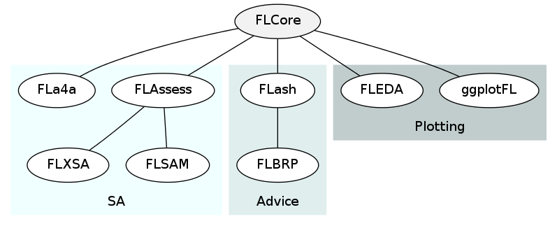

# FLR in a nutshell

 

# Installing the FLR packages

We start by installing the most recent version of the FLR packages. Most FLR packages are currently not available in [CRAN](http://cran.r-project.org), but are distributed through the FLR Project package repository. To install the first of the packages, *FLCore*, please type:


# install.packages(c('FLCore'), repos='http://flr-project.org/R')


# Loading data

# Creating FLQuant

# Plot

# Operations

# FLStock

# Stock Assessment

# FLSR

# Further info

